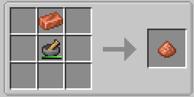
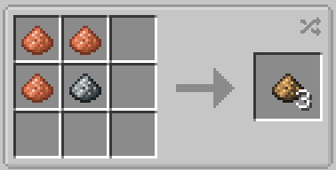

# Bronze

Bronze is the most important material in the [Steam Age](./index.md). 

To prepare the first batch of it you will need [Tin and Copper](../Ore-Generation.md).
Your first Bronze batch will be crafted in the Crafting Grid from 3 Copper Dust and 1 Tin Dust.

You can get Dusts by crushing ingots in a GregTech Mortar.

